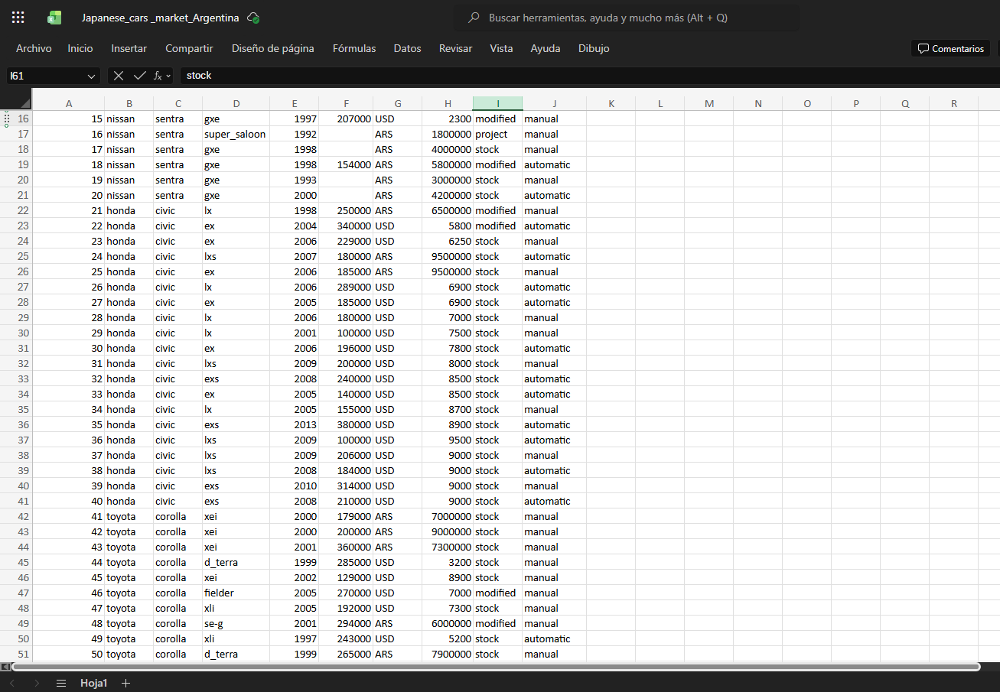
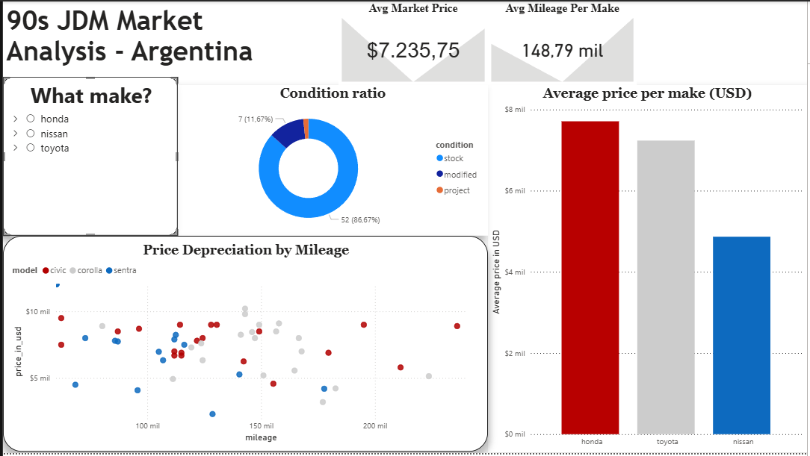

# End-to-End Data Pipeline: JDM Market Analysis (Argentina)

## Project Overview
This project is a complete end-to-end data analytics pipeline focusing on the Japanese Domestic Market (JDM) cars in Argentina. It demonstrates the full data lifecycle: starting with meticulous Data Entry and raw data structuring in Excel, advancing to a cloud-based SQL pipeline in Google BigQuery, and culminating in an interactive Power BI dashboard.

## Tech Stack & Workflow
* Data Entry & Raw Processing: Microsoft Excel
* Data Warehousing & Engineering: Google BigQuery (SQL)
* Data Visualization & Analytics: Power BI

## The Pipeline Architecture

### Phase 1: Data Entry & Raw Data Management (Excel)
* Manual Data Extraction: Handled the data entry process for over 50 local marketplace listings, ensuring high accuracy from the source.
* Data Cleansing: Standardized inconsistent text formats, resolved missing values, and structured unstructured descriptions into clean, categorical columns (e.g., tagging vehicles as "Stock" or "Modified").

  

### Phase 2: SQL Data Pipeline (BigQuery)
Developed a sequence of 5 logical SQL scripts to transform, normalize, and analyze the raw database:
1. [01_data_cleaning.sql](01_data_cleaning.sql): Created the foundational view, handled ARS to USD currency conversions, and standardized odometer readings from Kilometers to Miles.
2. [02_market_summary_by_model.sql](02_market_summary_by_model.sql): Generated aggregated market metrics to calculate the average price by make and model.
3. [03_modified_cars_analysis.sql](03_modified_cars_analysis.sql): Calculated the exact ratio of Stock vs. Modified vehicles across the fleet.
4. [04_market_volatility.sql](04_market_volatility.sql): Analyzed price gaps, identifying minimum, maximum, and average prices to assess market spread.
5. [05_mileage_penalty.sql](05_mileage_penalty.sql): Built a categorization system grouping vehicles by mileage tiers (<80k, 80k-120k, >120k) to measure exact depreciation curves.

### Phase 3: Data Visualization (Power BI)
* Designed a comprehensive, interactive dashboard connecting directly to the structured data to translate SQL insights into actionable visual metrics.

## Key Business Insights
* Price Leadership: The Honda Civic leads the market valuation at an average of $7,710 USD.
* Modification ratio: the Nissan Sentra is more prone to modifications than the Honda Civic or Toyota Corolla.
* Preservation Focus: A massive 86% of the analyzed japanese cars market remains in "Stock" condition, proving that original setups are highly prevalent.
* Brand Power vs. Mileage: Contrary to standard vehicle depreciation, the data reveals that mileage has a minimal impact on the pricing of these specific models. The Honda Civic, for instance, maintains high valuations ($6,000 - $8,000) even when approaching the 200,000-mile mark.
## Dashboard Preview

